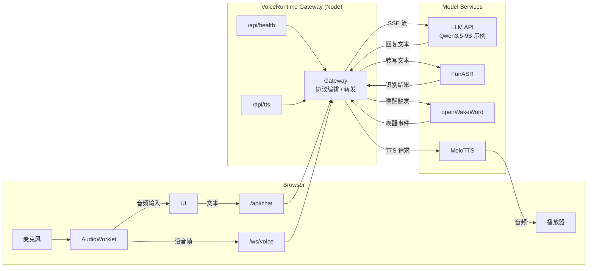
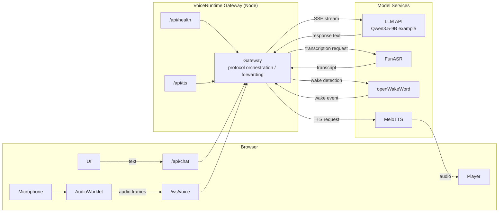

# VoiceRuntime

[中文](#中文) | [English](#english)

## 中文

VoiceRuntime 是一个面向本地和私有部署场景的浏览器语音运行时。它把文本对话、语音输入、唤醒词和本地 TTS 串成统一链路，前端入口是网页，后端通过 Node 网关连接 LLM、ASR 和 TTS 服务。

当前默认配置对 Qwen 系列模型比较友好，但项目本身不绑定某一个特定大模型，只要求上游提供 OpenAI 兼容接口。

### 当前能力

- 文本流式对话
- 语音输入
- 唤醒词模式
- FunASR 实时识别
- 本地 MeloTTS 播报
- 前端公开配置
- 服务端环境变量配置

### 当前验证环境

以下组合已验证可用，不代表唯一部署方式：

- GPU: RTX 4090
- LLM: `Qwen/Qwen3.5-9B`
- ASR: `paraformer-zh-streaming`
- TTS: `MeloTTS` 中文语音

### 架构概览

文本模式：

`Browser -> VoiceRuntime(Node) -> OpenAI-compatible LLM API -> SSE stream back to Browser`

语音模式：

`Browser(AudioWorklet) -> /ws/voice -> VoiceRuntime(Node) -> FunASR -> text -> LLM -> /api/tts -> MeloTTS -> Browser playback`

唤醒模式：

`Browser(AudioWorklet) -> /ws/voice -> openWakeWord -> FunASR -> LLM -> TTS`

基于当前实现的架构图：



### 项目结构

- [`server.js`](./server.js): Node 网关，负责静态资源、`/api/chat`、`/api/health`、`/api/tts`、`/ws/voice`
- [`public/app.js`](./public/app.js): 前端聊天与语音交互逻辑
- [`public/config.js`](./public/config.js): 浏览器可见的公开配置
- [`services/funasr_ws_server.py`](./services/funasr_ws_server.py): FunASR WebSocket 服务
- [`services/melotts_http_server.py`](./services/melotts_http_server.py): MeloTTS HTTP 服务
- [`bootstrap.sh`](./bootstrap.sh): 仓库初始化脚本
- [`requirements.runtime.txt`](./requirements.runtime.txt): 通用 Python 运行依赖

### 快速开始

1. 安装 Node 依赖

```bash
npm install
```

2. 复制环境变量模板

```bash
cp .env.example .env
```

3. 编辑 `.env`

常见配置：

```bash
VOICERUNTIME_BASE_URL=http://127.0.0.1:8080/v1
VOICERUNTIME_MODEL=Qwen/Qwen3.5-9B
VOICERUNTIME_SYSTEM_PROMPT=You are a concise, capable assistant running in VoiceRuntime.
VOICERUNTIME_ASR_PYTHON=python3
VOICERUNTIME_TTS_PYTHON=/path/to/python
MELOTTS_REPO=/path/to/MeloTTS
```

4. 启动

```bash
npm run dev
```

默认访问：

- `http://localhost:3010`

### 一键准备

只做基础初始化：

```bash
./bootstrap.sh
```

连同本地 Python 虚拟环境一起准备：

```bash
./bootstrap.sh --python
```

这个脚本会：

- 创建 `.env`
- 安装 Node 依赖
- 可选创建 `.venv`
- 安装通用 Python 运行依赖

它不会自动决定 CUDA / Torch 版本，也不会自动 clone `MeloTTS`。

### 环境变量

项目优先使用 `VOICERUNTIME_*` 变量。  
为兼容旧配置，`LORARUNTIME_*` 变量仍然可用。

完整模板见 [`.env.example`](./.env.example)。

### 前端公开配置

浏览器可见配置集中在 [`public/config.js`](./public/config.js)。

适合放这里的内容：

- 接口路径
- 前端默认展示值
- 唤醒等待时长
- 自动播报开关
- 已验证环境说明

不适合放这里的内容：

- 私有 IP
- 令牌
- 绝对路径
- 内网域名

### API

- `GET /api/health`: 返回服务健康状态和默认配置
- `POST /api/chat`: 对话接口
- `POST /api/tts`: TTS 接口
- `GET /ws/voice`: 语音输入 WebSocket 入口

### 依赖

Node:

- [`ws`](https://www.npmjs.com/package/ws)

Python:

- `funasr`
- `openwakeword`
- `numpy`
- `websockets`
- `soundfile`

外部模型 / 服务：

- Qwen
- FunASR `paraformer-zh-streaming`
- MeloTTS
- openWakeWord models

### 官方地址

项目本身不附带第三方模型权重。请按官方来源自行获取：

- Qwen 官方仓库: <https://github.com/QwenLM/Qwen>
- Qwen 官方 Hugging Face 主页: <https://huggingface.co/Qwen>
- FunASR 官方仓库: <https://github.com/modelscope/FunASR>
- FunASR 流式 Paraformer 官方模型页: <https://www.modelscope.cn/models/iic/speech_paraformer_asr_nat-zh-cn-16k-common-vocab8404-online>
- openWakeWord 官方仓库: <https://github.com/dscripka/openWakeWord>
- openWakeWord 模型说明: <https://github.com/dscripka/openWakeWord/tree/main/docs/models>
- MeloTTS 官方仓库: <https://github.com/myshell-ai/MeloTTS>

说明：

- 当前配置里的 `Qwen/Qwen3.5-9B` 更像是你的本地推理后端暴露出来的模型标识。
- 如果你的后端使用别的官方 Qwen 模型 ID，请直接修改 `.env` 中的 `VOICERUNTIME_MODEL`。
- 发布仓库时不要包含任何第三方模型权重，包括 Qwen、FunASR、openWakeWord 或 MeloTTS 相关权重文件。

### 致谢

感谢这些开源项目与团队：

- [Qwen](https://github.com/QwenLM/Qwen)
- [FunASR](https://github.com/modelscope/FunASR)
- [openWakeWord](https://github.com/dscripka/openWakeWord)
- [MeloTTS](https://github.com/myshell-ai/MeloTTS)
- [ws](https://github.com/websockets/ws)

### 开源协议建议

仓库当前使用 `Apache-2.0`，原因是它与当前依赖兼容，并且比 MIT 多了明确的专利授权条款，更适合后续扩展。

### 第三方许可证注意事项

- `ws` 是 MIT
- `FunASR` 代码仓库是 MIT，但具体模型权重可能是单独许可
- `MeloTTS` 代码仓库是 MIT
- `openWakeWord` 代码仓库是 Apache-2.0，但预训练模型需要单独确认许可
- 如果你在 README 中推荐 Qwen，建议作为“已验证示例”，不要默认暗示重新分发模型权重

最稳妥的方式：

- 仓库只放代码和配置模板
- 模型权重由用户按官方来源自行下载
- 单独区分“代码许可证”和“模型许可证”

### Github 发布前检查

- `.env` 不要提交
- 模型权重目录不要提交
- 不要提交私有 API 地址、内网域名、令牌
- 截图不要带内网信息

仓库地址：

- <https://github.com/CrotAA/VoiceRuntime>

## English

VoiceRuntime is a browser-based voice runtime for local and private deployments. It connects text chat, speech input, wake word handling, and local TTS into one pipeline, with a web frontend and a Node gateway coordinating the LLM, ASR, and TTS services.

The default setup is friendly to Qwen-family models, but the project is not tied to a single LLM. It only expects an OpenAI-compatible upstream API.

### Features

- Streaming text chat
- Speech input
- Wake word mode
- Real-time FunASR transcription
- Local MeloTTS playback
- Public frontend configuration
- Environment-variable-driven server config

### Validated Setup

The following setup has been validated, but it is not the only supported deployment:

- GPU: RTX 4090
- LLM: `Qwen/Qwen3.5-9B`
- ASR: `paraformer-zh-streaming`
- TTS: Chinese voice with `MeloTTS`

### Architecture Overview

Text mode:

`Browser -> VoiceRuntime(Node) -> OpenAI-compatible LLM API -> SSE stream back to Browser`

Voice mode:

`Browser(AudioWorklet) -> /ws/voice -> VoiceRuntime(Node) -> FunASR -> text -> LLM -> /api/tts -> MeloTTS -> Browser playback`

Wake mode:

`Browser(AudioWorklet) -> /ws/voice -> openWakeWord -> FunASR -> LLM -> TTS`

Architecture diagram based on the current implementation:



### Project Structure

- [`server.js`](./server.js): Node gateway for static assets, `/api/chat`, `/api/health`, `/api/tts`, and `/ws/voice`
- [`public/app.js`](./public/app.js): frontend chat and voice interaction logic
- [`public/config.js`](./public/config.js): public browser-side config
- [`services/funasr_ws_server.py`](./services/funasr_ws_server.py): FunASR WebSocket service
- [`services/melotts_http_server.py`](./services/melotts_http_server.py): MeloTTS HTTP service
- [`bootstrap.sh`](./bootstrap.sh): repository bootstrap script
- [`requirements.runtime.txt`](./requirements.runtime.txt): generic Python runtime dependencies

### Quick Start

1. Install Node dependencies

```bash
npm install
```

2. Copy the environment template

```bash
cp .env.example .env
```

3. Edit `.env`

Typical settings:

```bash
VOICERUNTIME_BASE_URL=http://127.0.0.1:8080/v1
VOICERUNTIME_MODEL=Qwen/Qwen3.5-9B
VOICERUNTIME_SYSTEM_PROMPT=You are a concise, capable assistant running in VoiceRuntime.
VOICERUNTIME_ASR_PYTHON=python3
VOICERUNTIME_TTS_PYTHON=/path/to/python
MELOTTS_REPO=/path/to/MeloTTS
```

4. Start the app

```bash
npm run dev
```

Default URL:

- `http://localhost:3010`

### Bootstrap

Basic repository setup:

```bash
./bootstrap.sh
```

Setup plus local Python virtualenv:

```bash
./bootstrap.sh --python
```

This script:

- creates `.env`
- installs Node dependencies
- optionally creates `.venv`
- installs generic Python runtime dependencies

It does not decide your CUDA / Torch build and it does not clone `MeloTTS`.

### Environment Variables

The project now prefers `VOICERUNTIME_*` variables.  
For backward compatibility, `LORARUNTIME_*` variables are still accepted.

See [`.env.example`](./.env.example) for the full template.

### Public Frontend Config

Browser-visible config lives in [`public/config.js`](./public/config.js).

Good things to place there:

- API paths
- frontend defaults
- wake timing
- auto-play settings
- validated environment notes

Do not place these there:

- private IPs
- tokens
- absolute paths
- internal domains

### API

- `GET /api/health`: health status and default config
- `POST /api/chat`: chat endpoint
- `POST /api/tts`: TTS endpoint
- `GET /ws/voice`: voice WebSocket entrypoint

### Dependencies

Node:

- [`ws`](https://www.npmjs.com/package/ws)

Python:

- `funasr`
- `openwakeword`
- `numpy`
- `websockets`
- `soundfile`

External models / services:

- Qwen
- FunASR `paraformer-zh-streaming`
- MeloTTS
- openWakeWord models

### Acknowledgements

Thanks to these open-source projects and teams:

- [Qwen](https://github.com/QwenLM/Qwen)
- [FunASR](https://github.com/modelscope/FunASR)
- [openWakeWord](https://github.com/dscripka/openWakeWord)
- [MeloTTS](https://github.com/myshell-ai/MeloTTS)
- [ws](https://github.com/websockets/ws)

### License Recommendation

This repository currently uses `Apache-2.0`. It is a good fit because it is compatible with the current dependencies and includes explicit patent grants, which is useful for future expansion.

### Third-Party License Notes

- `ws` is MIT
- the FunASR code repository is MIT, but model weights may use separate licenses
- the MeloTTS code repository is MIT
- the openWakeWord code repository is Apache-2.0, but pretrained models should be checked separately
- if you mention Qwen in the README, treat it as a validated example rather than implying model-weight redistribution

Safest approach:

- keep this repository code-only
- let users download model weights from official sources
- distinguish clearly between code licenses and model licenses

### Official Sources

This repository does not ship third-party model weights. Users should download them from official sources:

- Qwen official repository: <https://github.com/QwenLM/Qwen>
- Qwen official Hugging Face page: <https://huggingface.co/Qwen>
- FunASR official repository: <https://github.com/modelscope/FunASR>
- FunASR streaming Paraformer official model page: <https://www.modelscope.cn/models/iic/speech_paraformer_asr_nat-zh-cn-16k-common-vocab8404-online>
- openWakeWord official repository: <https://github.com/dscripka/openWakeWord>
- openWakeWord model docs: <https://github.com/dscripka/openWakeWord/tree/main/docs/models>
- MeloTTS official repository: <https://github.com/myshell-ai/MeloTTS>

Notes:

- `Qwen/Qwen3.5-9B` in this project should be treated as a local backend model identifier or deployment alias.
- If your upstream server exposes a different official Qwen model ID, update `VOICERUNTIME_MODEL` in `.env`.
- Do not publish model weight files with this repository, including Qwen, FunASR, openWakeWord, or MeloTTS weights.

### Pre-Publish Checklist

- do not commit `.env`
- do not commit model weight directories
- do not commit private API endpoints, internal domains, or tokens
- do not include internal network details in screenshots

Repository:

- <https://github.com/CrotAA/VoiceRuntime>
